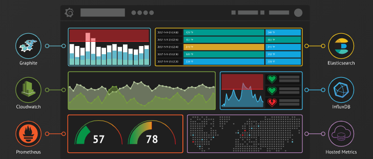
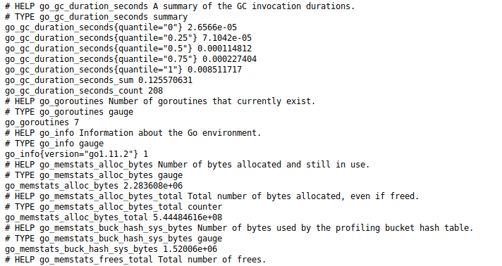
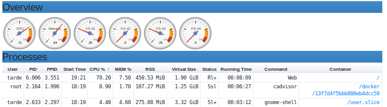
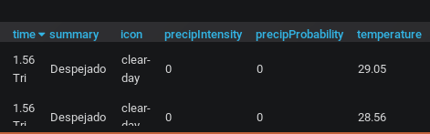
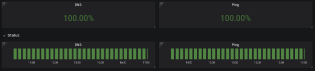

theme: material
title: Monitorización con Grafana
author: Daniel Juárez Martínez
cover: s3.jpg

## Introducción

1. ¿Cuál es el objetivo? 
2. ¿Qúe es Grafana? 
3. ¿Qué es Prometheus?
   1. Node-exporter 
   2. Cadvisor
4. Alertas
5. Plugins
6. Grafana + Panoply + Analytics + Blog

## ¿Cuál es el objetivo?
Hacer funcionar todos los servicios de los que se dispone.
 El objetivo es implantarlo en una empresa para mejorar la calidad de trabajo productivo.
- Aprovechar al máximo los recursos
- Prevenir incidencias
- Ahorro de tiempo
## Grafana ¿Qué es?

Es un conjunto de herramientas de código abierto para el análisis y visualización de métricas.
imagen de grafana con las plataformas.

## Prometheus
Es un sistema de monitoreo de sistemas y servicios. Recopilando métricas en tiempo real.
- Node-exporter
- Cadvisor

## Node-Exporter
Exportador que analiza el hardware y del Sistema del equipo.
- CPU
- Memoria Usada

## Cadvisor
Es un agente que monitorea,recogiendo métricas de uso de recursos de los contenedores.
- uso de CPU por núcleo
- Procesos en uso

 
## Alertas
Grafana contiene un sistema de alertas que permite avisarnos  en caso de incidencia.
 - Telegram
 - Slack
 - Email
## Plugins
Es un componente que tiene la capacidad de ampliar las funciones de nuestra estructura.
- Darksky
- WorldPing
## Darksky
Es un plugin de metereología, recolecta información en tiempo real.
- Tiempo Actual
- Temperatura

## WorldPing 
Es un complemento que nos sirve para monitorizar el estado de nuestra web.
- Ping
- DNS

 

## Grafana + Panoply + Analytics + Blog
Estas son las plataformas con las que he realizado el monitoreo.
Permitiendo obtener un análisis las 24 horas del día.
- Tiempo de Visita
- Navegador usado

## Agradecimientos    

